# Android-Portfolio
This is my portfolio as a android developer

# Football app
Currently working on football app that follows football players, clubs and countries

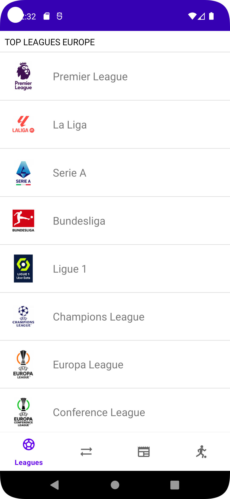
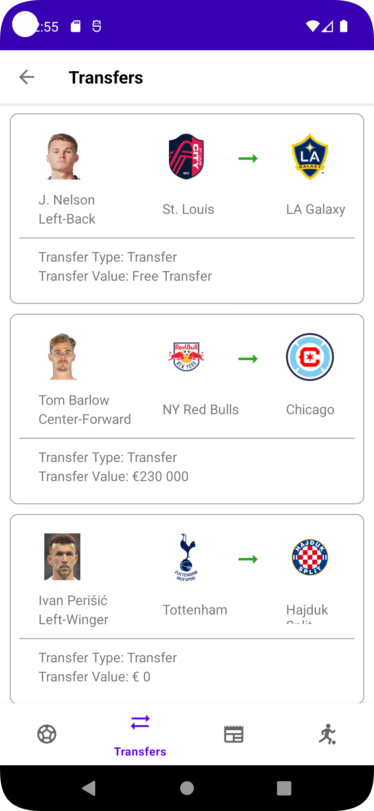

### Technolgies : Android SDK , Java, Xml, Firebase

# Online Store

Developed an e-commerce application with implemented registration and login functionalities

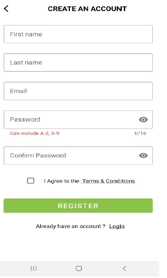
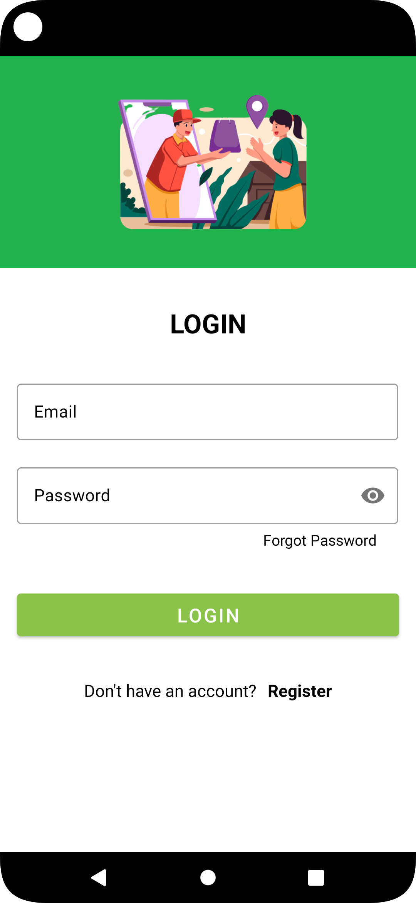
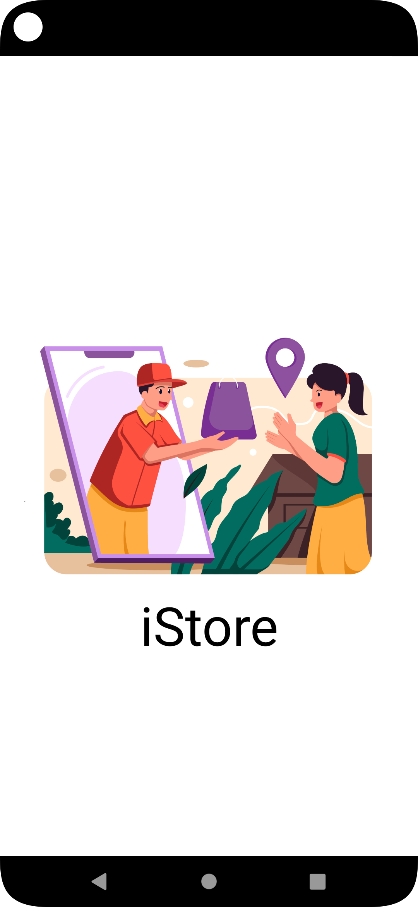
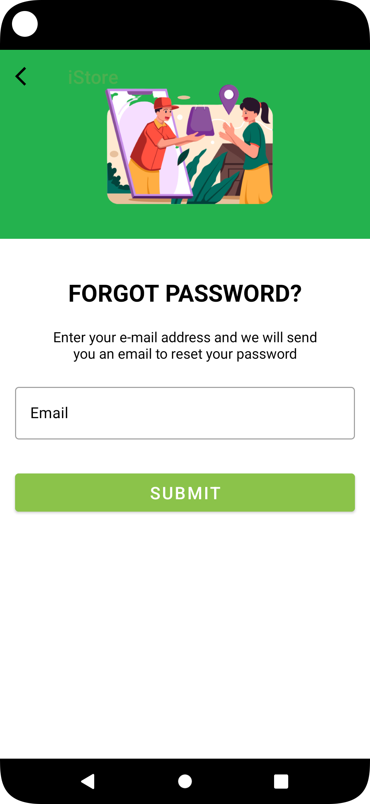
  
### Technolgies : Android SDK , Kotlin, Xml, Firebase

# Kids learning app

Simple kids learning app making few categories using Card View. 

### Technolgies : Android SDK , Kotlin, Xml

# Unit Converter

Unit converter app that converts imperial units to metric units and reverse.

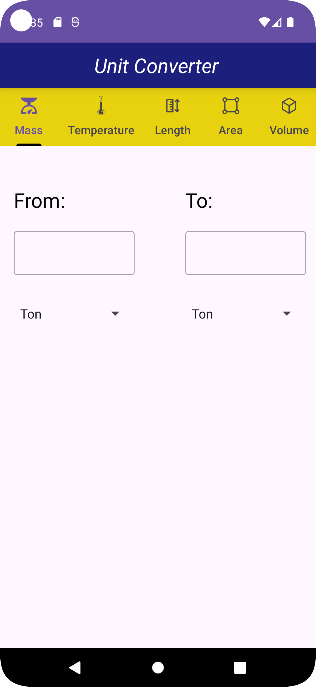

### Technolgies : Android SDK , Java, Xml

# BillTip Calculator

Simple app that calculates tip amount based on bill amount

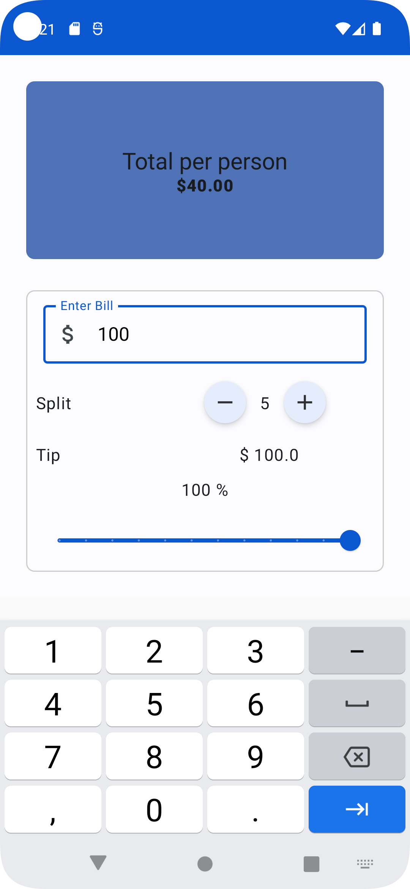
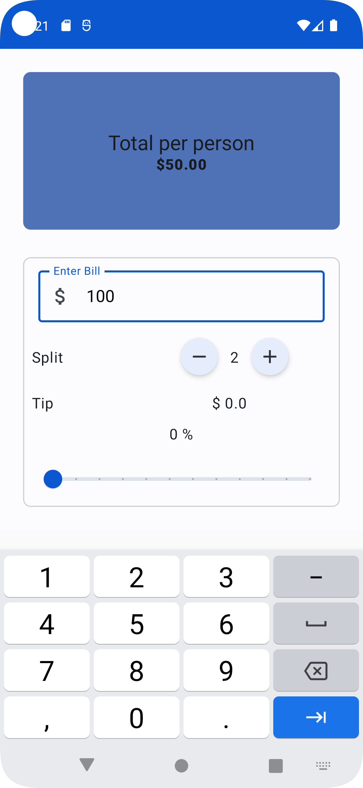

### Technolgies : Android SDK , Kotlin, Jetpack Compose

# Unit Converter

Units converter app that converts units:

* Length
* Time
* Mass
* Temperature
* Volume
* Area
* Speed
* Energy
* Power
* Pressure
* Frequency
* Currency.

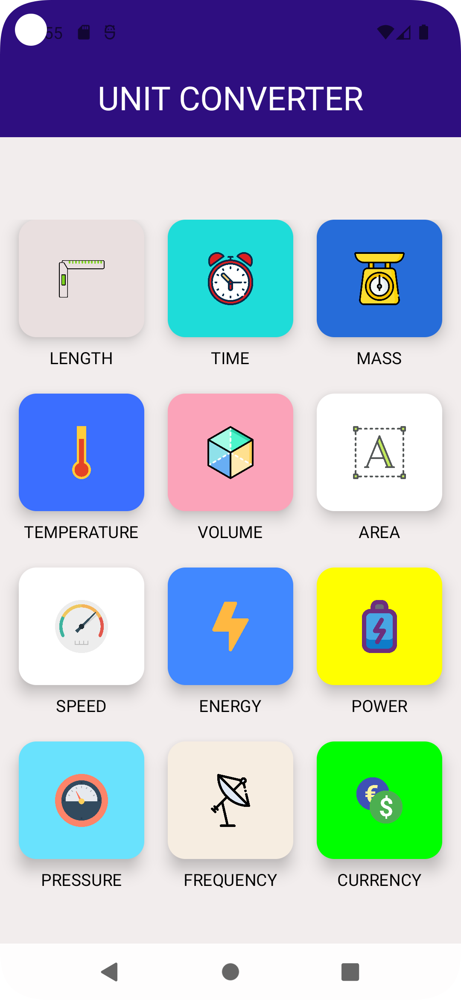
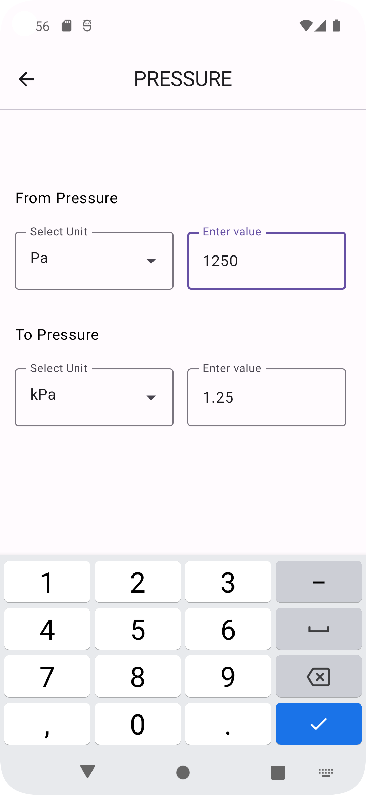
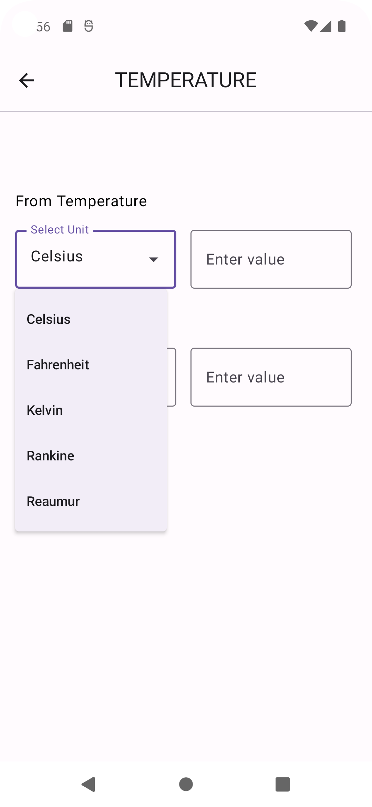

### Technolgies : Android SDK , Kotlin, Jetpack Compose
