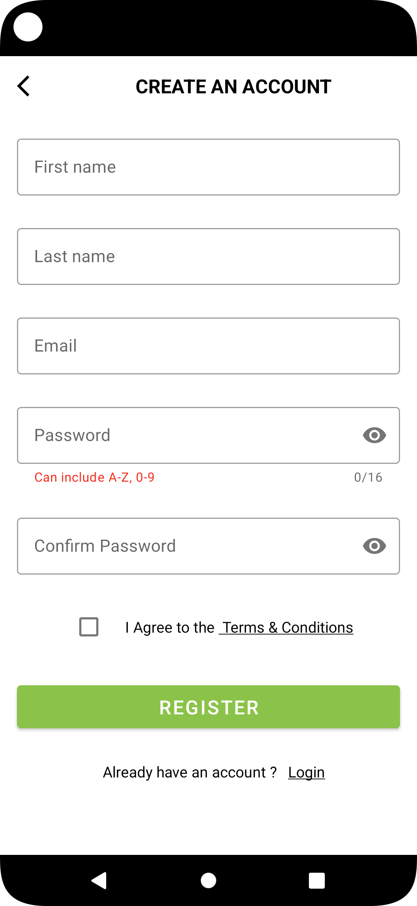

# Android-Portfolio
This is my portfolio as a android developer

&nbsp;&nbsp;&nbsp;

# Football app
Currently working on football app that follows football players, clubs and countries

### Technolgies : Android SDK , Java, Xml, Firebase

# Online Store

Developed an e-commerce application with implemented registration and login functionalities

  
### Technolgies : Android SDK , Kotlin, Xml, Firebase

# Kids learning app

Simple kids learning app making few categories using Card View. 

### Technolgies : Android SDK , Kotlin, Xml

# Unit Converter

Unit converter app that converts imperial units to metric units and reverse.

### Technolgies : Android SDK , Java, Xml
